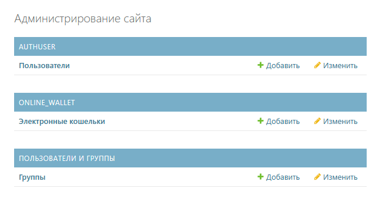
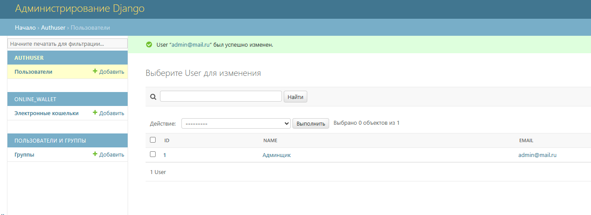
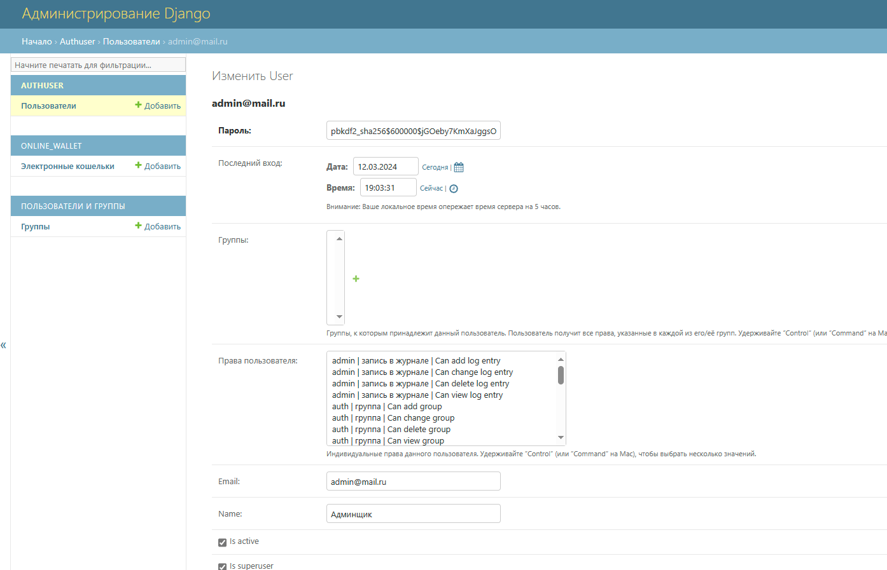
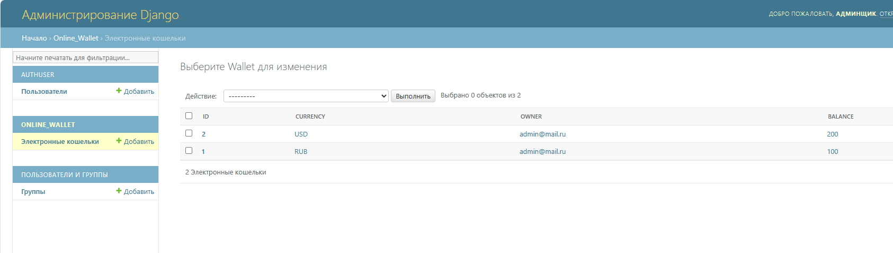
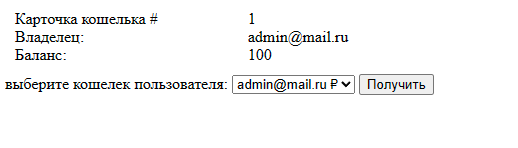
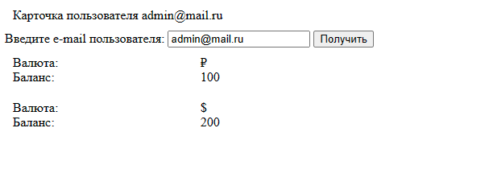

# e_wallet
Электронный кошелек
Для работы приложения необходимо:
- создать файл ```config_app/db.sqlite3```
- создать дирректори в:
  - ```authuser/migrations```
  - ```config_app/migrations```
- Внутри папки ```config_app``` запустить миграцию командами:
  - ```python manage.py makemigrations```
  - ```python manage.py migrate ```
- Создать суперпользователя
  - ```python manage.py createsuperuser```
- Запустить сервер:
  - ```python manage.py runserver```

Через django-админ (/admin/) можно увидеть созданных пользователй, также там можно создать электронные кошельки для созданных пользователей









Созданную БД и папки не отслеживать в git!

У сервиса 2 рабочих роута:
- /card_wallet (роут главной страницы является аналогичным) : отображает созданные кошельки пользователей. При выборе отображается информация по кошельку


- /card_users : по введенному e-mail ищет все кошельки и отображает информацию по ним (Валюта, Баланс)


